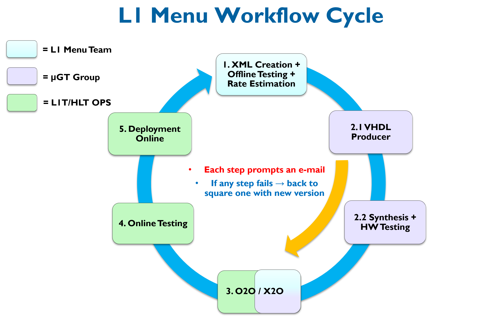

# L1Menu2018
This repository contains the latest developments on the Level-1 (L1) trigger menus developed by the L1 Menu Team (L1T-DPG), for the 2018 data-taking period. 

* Twiki with most important information on the L1 menu development, including the standard workflow for developing, testing and deploying a new menu online: [L1 Trigger Menu](https://twiki.cern.ch/twiki/bin/view/CMS/SWGuideL1TriggerMenu)

* The most updated information on the official L1 menus, inlcuding the differences to the previous versions, is listed in the table in the L1 Menu Twiki: [Official L1 Menus](https://twiki.cern.ch/twiki/bin/viewauth/CMS/SWGuideL1TriggerMenu#Official_L1_Menus)

### Branches:
* **master**: contains official menus ready to be shared
* **develop**: development versions of menus

**IMPORTANT:**
* Any change in the menu should trigger the creation of a new XML version with a new version name.
* Potentially, the algorithm bit (TME index) mapping can change from one version to another (due to re-ordering).
* If the version number changes, HLT should expect that corresponding changes would also be required. The scale of the changes is reflected in version number that is incremented. 

### Naming:
* Development versions (before official release) to be appended by \_dev\[#\] (# starting from 1):
  * L1Menu\_Collisions2018\_v\[X\]\_dev\[#\]
* Official release versions following semantic versioning (X, Y, Z starting from 0):
  * L1Menu\_Collisions2018\_v\[X\]\_\[Y\]\_\[Z\]

    * X = trigger train number (implying major changes like adding or removing a significant amount of algorithms)
    * Y = addition or removal of **physics** algorithms (eg. addition of backup seeds)
    * Z = addition of algorithms used for **testing**. Furthermore, this number should cover any other specific **minor** cases. 
  
Furthermore, in Step 2.1 of the workflow cycle below, an additional suffix '-d\[D\]' (standing for 'distributed', D starting from 1) is appended to the XML filename to indicate the implementation of the menu.

### Workflow:

* A menu needs to complete the full standard cycle (blue arrow) for it to be deployed online for data-taking.
* The yellow arrow corresponds to directly passing the 'bare' XML to be manually X2O'ed, so that it can be used for offline HLT studies before the synthesis and testing by the uGT group is complete.
