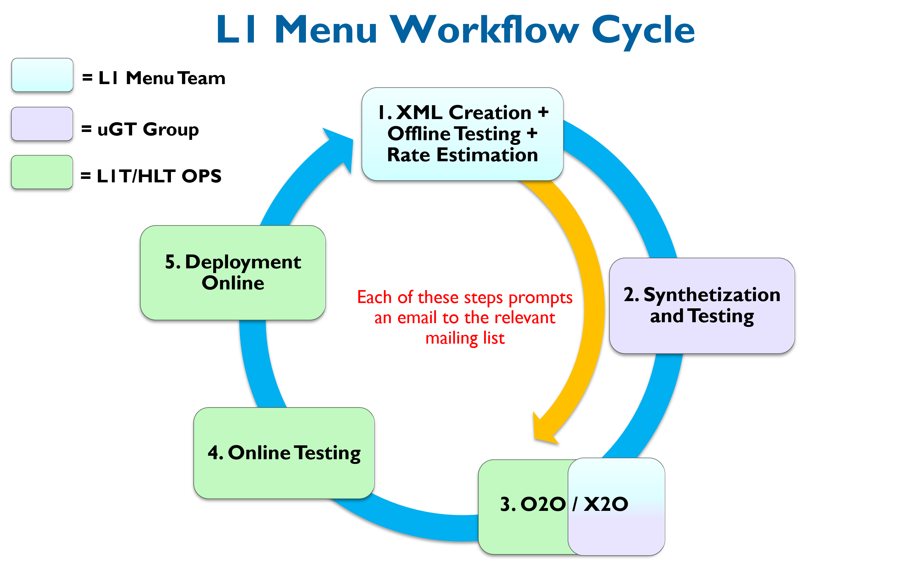

# L1Menu2018
This repository contains the latest developments on the Level-1 (L1) trigger menus developed by the L1 Menu Team (L1T-DPG), for the 2018 data-taking period. 

Twiki with most important information on the L1 menus including the standard workflow for developing, testing and deploying a new menu online: [L1 Trigger Menu](https://twiki.cern.ch/twiki/bin/view/CMS/SWGuideL1TriggerMenu)

### Branches:
* **master**: contains official menus ready to be shared
* **develop**: development versions of menus

### Naming:
* Development versions (before official release) to be appended by \_dev\[D\] (starting from D = 1):
  * L1Menu\_Collisions2018\_v\[X\]\_dev\[D\]
* Official release versions following semantic versioning (X, Y, Z, starting from 0):
  * L1Menu\_Collisions2018\_v\[X\]\_\[Y\]\_\[Z\]

    * X = trigger train number
    * Y = addition or removal of **physics** algorithms (seeds)
    * Z = addition of algorithms used for testing
  
Furthermore, in step 2 of the workflow cycle below an additional suffix is appended to the XML filename to indicate the implementation of the menu.

### Workflow:

* A menu needs to complete the full standard cycle (blue arrow) for it to be deployed online for data-taking.
* The yellow arrow corresponds to directly passing the 'bare' XML to be manually X2O'ed, so that it can be used for offline HLT studies before the synthesis and testing by the uGT group is complete.
